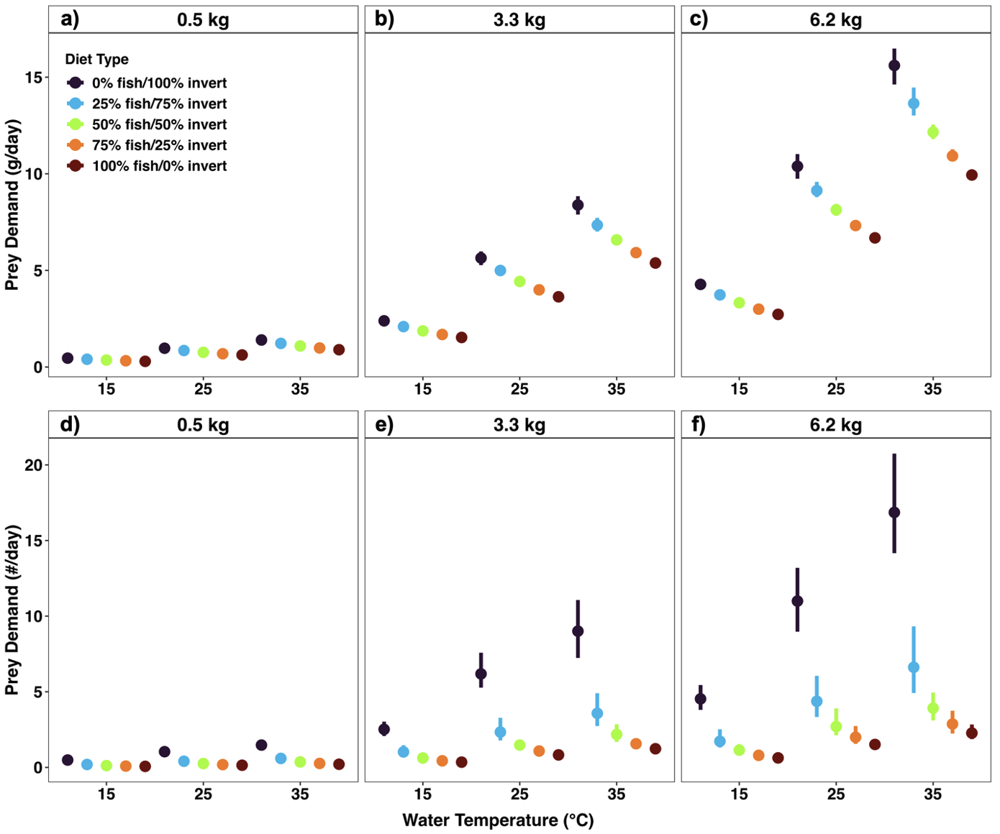
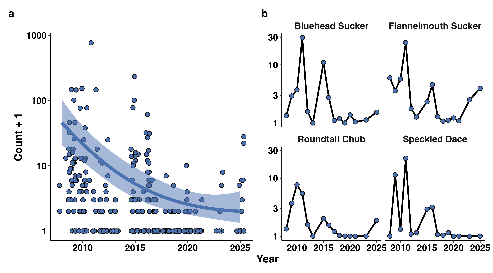

I am a broadly trained aquatic ecologist whose research centers on understanding how the direct and indirect effects of global change (e.g., increasing temperatures, variable hydrology, shifting size distributions) shape animal populations and communities via physiological tradeoffs, and how these changes propagate to influence nutrient cycling and energy flow. I have been fortunate to conduct research in freshwater, estuarine, and marine ecosystems across temperate, subtropical, and tropical climates. While my research has typically focused on fish, my research skills and interests extend beyond a given study system (1). My research takes an integrative approach that uses a combination of field, experimental, and modeling approaches to build predictive frameworks and provide a more holistic understanding of the natural world that informs conservation efforts, as well as ecological theory. My academic experiences have given me the knowledge and skills needed to develop a strong research program in any setting. For instance, I have demonstrated my ability to acquire funding from state and regional agencies to support my dissertation research. Additionally, I have been the lead principal investigator (PI) and co-PI on multiple grants receiving support from the National Science Foundation in partnership with the National Center for Ecological Analysis and Synthesis (NCEAS). I am also currently developing several grant proposals at The Ohio State University (OSU). Here, I use select publications to highlight my background in data science and synthesis, as well as my work that scales multiple, interconnected areas of research (i.e., movement, trophic, population, and community ecology) to better understand the ecological consequences of global change.

[**Data Science and Synthesis**]{.smallcaps}: The scale of my research interests requires the ability to link and analyze large, often idiosyncratic data streams that are collected across different spatiotemporal scales. For example, I have helped lead the collection, maintenance, analysis, and publishing of long-term acoustic telemetry (2) and electrofishing (3) datasets in support of the Comprehensive Everglades Restoration Plan. I have also had the opportunity to lead the discovery and wrangling of disparate ecological datasets for the harmonization and publishing of a large, synthesis dataset at NCEAS (4). The generation of datasets that span large spatial and temporal scales provides a unique opportunity to address complex ecological questions. For instance, it is widely accepted that the stability of ecosystem function is regulated by biodiversity. However, much of what we know about biodiversity effects on ecosystem function has been gathered from plant systems in temperate climates. Further, the stability of ecosystem functions provided by animals has rarely been assessed. Using the harmonized dataset described above, we synthesized \~25 years of data from six long-term ecological monitoring programs and 146 sampling locations spanning coral reef, mangrove, seagrass, and kelp ecosystems to understand how biodiversity impacts the temporal stability of nutrients recycled by fish communities across the globe (5). Species richness had strong, positive effects on the temporal stability of consumer-mediated nutrient dynamics (CND) across ecosystems (Fig. 1). However, species asynchrony was the most important driver within (i.e., site-to-site) ecosystems. The findings of this study extend diversity-stability theory to consumer function and highlight the importance of scale in ecology.

[**Movement Ecology**]{.smallcaps}: Animal movement – from daily excursions that span a few meters to annual migrations that span thousands of kilometers – is a fundamental process that links spatially discrete habitats. My research explores the ecological causes and consequences of animal movement across a diversity of habitat types and species. Research on the ecological consequences of animal movement has focused on large, charismatic species (e.g., Pacific salmonids, whales). However, our previous research has shown that nongame fishes, such as suckers (Family Catostomidae) can translocate a large amount of nitrogen (N) and phosphorus (P) during their annual spawning migrations in the Southeastern United States, with implications for ecosystem structure and function in recipient rivers (6,7). For instance, we demonstrated that populations of Smallmouth Buffalo (Ictiobus bubalus) are capable of delivering \~730 kg of N and \~80 kg of P to a small, hyper-oligotrophic stream (Citico Creek, Cherokee National Forest, TN) via excretion and egg deposition, despite their iteroparous life histories that are constrained to freshwater. Moving from streams to seascapes, our work also examines how animals navigate environments recovering from disturbance. For instance, we used acoustic telemetry, remote sensing, and machine learning to investigate the multi-scale habitat selection of Spotted Seatrout (Cynoscion nebulosus, trout hereafter) in a large bay system (Florida Bay, Everglades National Park, FL). Trout responded to multiple scales, as there were three patch-scale (Halodule cover, standard deviation of submerged aquatic vegetation \[SAV\] cover, and SAV species richness) and one seascape-scale (patch density) predictor in the top model (8). However, responses were scale-specific, exhibiting logistic responses to seascape variables and optimal responses to patch characteristics. This study highlights the importance of habitat selection across multiple scales as global change not only alters species ranges, but local seascapes as well (Fig. 2).

[**Trophic Ecology**]{.smallcaps}: Global change is altering important trophic interactions through changes in prey availability, predator densities, and physiological tradeoffs. My research explores how the direct and indirect consequences of global change interact to influence predator-prey dynamics and the flow of energy through animal systems. For example, variation in space use among conspecifics can emerge from foraging strategies that track available resources. We used long-term tracking of Common Snook (Centropomus undecimalis, snook hereafter) movement and trophic dynamics in a coastal river system (Shark River \[SR\], Everglades National Park, FL) to test how intraspecific variation in space use changes within and across years, and its implications for the trophic niche size of individual predators. An increase in the proportion of individuals occupying unique habitats was closely linked to adjacent marsh water levels that are known to determine the seasonal availability of floodplain resources for snook, resulting in a decrease to individual trophic niche volume (9). This study shows the importance of flow regimes for individual resource (both space and prey) specialization. Consumers are capable of altering their foraging behaviors to cope with changes to the resource landscape. However, few studies have considered that shifting resource landscapes (e.g., prey declines, increases) may be linked to changes such as warming temperatures that alter the energy needs of a predator. As such, the relative quality of an animal’s diet should consider prey quality and energy needs. We linked body size, temperature, hydrology, and consumer energy needs using empirical diet and prey quality data alongside models of consumer energetic demand and predation simulations to provide a more holistic understanding of trophic dynamics in the wake of global change (10). Predation simulations revealed that snook consuming invertebrate-dominated diets required greater prey biomass, as well as an increased number of individual prey items, to meet their daily energetic requirements when compared to diets containing fish (Fig. 3). However, if snook maintained even a small proportion of fish in their diet, it greatly reduced the number and biomass of prey needed to meet their energetic requirements. This study highlights the dynamic interplay between internal state and external conditions for shaping the foraging ecology of predators.

[**Population and Community Ecology**]{.smallcaps}: Population and community dynamics provide the foundation for understanding how global change drivers reshape ecosystem structure and function (Fig. 1-3). My research in this area focuses on understanding how biotic and abiotic drivers interact to regulate population abundances and determine patterns of biodiversity and community assembly. For example, the natural flow regimes of rivers are being reshaped by numerous global change stressors with implications for population and community dynamics across multiple trophic groups. For instance, we used a long-term monitoring dataset to link phenological shifts in the flow of a dryland river (White River \[WR\], UT) in the Colorado River Basin (CRB) to native and non-native fish abundances (11). The abundance of native fishes was consistently low and decreased rapidly over the period of record (Fig. 4), with non-native fishes consistently high and remaining relatively unchanged. This is particularly concerning as Flannelmouth and Bluehead Suckers (Catostomus latipinnis and discobolus, respectively) are extirpated across more than 50% of their range. We also used a series of multivariate approaches to investigate the role of flow reductions in shaping the trait composition of invertebrate assemblages across seven rivers (including the WR) in the CRB (12). Invertebrate communities were characterized by collector-filterer trophic roles, synchronized emergence strategies, and strong adult flying strengths in rivers with large flow reductions. As warming temperatures and consumptive water needs continue to intensify, understanding the impact of water scarcity on population and community dynamics will be needed to conserve aquatic ecosystems in the wake of a hot, dry future.

[**References**]{.smallcaps}[(\*undergraduate student; ^+^graduate student)]{.smallcaps}

1\. Strebler, M., M. Grisnik, [**M. White**]{.underline}, and R. Hanscom. **2025**. *Herpetological Conservation and Biology.*

2\. Rehage, J., J. Massie, N. Viadero, J. Sturges, [**M. White**]{.underline}, and C. Atkinson. **2025**. *Environmental Data Initiative.*

3\. Rehage, J., M. Heithaus, R. Boucek, J. Massie, [**M. White**]{.underline}, J. Sturges, and C. Atkinson. **2025**. *Environmental Data Initiative.*

4\. [**White, M**.]{.underline}, L. Kui, A. Chen, B. Strickland, S. Grier, J. Peters, and (12 additional authors). **2025**. *Environmental Data Initiative*.

5\. [**White, M**.]{.underline}, N. Lemoine, W. James, J. Allgeier, D. Burkepile, J. Rehage, and 14 additional authors). **In revision**. *PNAS*.

6\. [**White, M**.]{.underline}, K. Wheeler, R. Hudson, and J. Murdock. **2023**. *Ecology of Freshwater Fish*.

7\. Hudson, R., K. Wheeler, [**M. White**]{.underline}, and J. Murdock. **2024**. *Ecology of Freshwater Fish*.

8\. Rodemann, J., [**M. White**]{.underline}, W. James, L Griffin, S. Costa, B. Furman, S. Pittman, and (3 additional authors). **2025**. *Scientific Reports*.

9\. Santos, R., [**M. White**]{.underline}, W. James, M. Viadero, J. Massie, R. Boucek, and J. Rehage. **2025**. *Scientific Reports*.

10\. [**White, M.**]{.underline}, W. James, J. Lesser, R. Rezek, J. Rodemann, and (3 additional authors). **2025**. *Marine and Coastal Fisheries*.

11\. Palmieri, M.^**+**^, [**M. White**]{.underline}, and C. Pennock. **In prep**. *Transactions of the American Fisheries Society.*

12\. [**White, M.**]{.underline}, C. Lyles, L. Bruckerhoff, C. Yackulic, P. Budy, and C. Pennock. **In review**. *Freshwater Biology.*

13\. Goldner, V.**\***., [**M. White**]{.underline}, C. Eggenberger, A. Jones and (8 additional authors). **2026**. *Marine and Coastal Fisheries*.

[Research Funding]{.smallcaps}

{width="100%"}

